# CNN Handbook: The Complete Reference for AI Engineers & Researchers

---

## Introduction

### What is Deep Learning?
Deep Learning (DL) is a specialized subset of Machine Learning (ML) and Artificial Intelligence (AI) inspired by the structure and function of the human brain's neural pathways. Mathematically, deep learning models are hierarchical function approximators. They learn to represent data through multiple levels of abstraction, mapping raw inputs (e.g., pixel values) to high-level semantic representations (e.g., object categories) via a series of non-linear transformations.

Unlike classical ML algorithms that require manual, expert-driven feature engineering, deep learning utilizes end-to-end representation learning. The network optimization process (backpropagation) automatically determines the optimal representations directly from the raw data.

### What is Computer Vision?
Computer Vision (CV) is the multidisciplinary field of AI that enables computational systems to reconstruct, interpret, and understand the 3D visual world from 2D images or video sequences. The primary objective of CV is to replicate the human visual system's capability to identify objects, infer spatial relationships, track movements, and comprehend semantic scenes.

### Why CNNs Were Invented
Prior to Convolutional Neural Networks (CNNs), digital image processing and computer vision relied heavily on hand-crafted features such as:
*   **SIFT** (Scale-Invariant Feature Transform)
*   **HOG** (Histogram of Oriented Gradients)
*   **LBP** (Local Binary Patterns)

These traditional methods had severe limitations:
1.  **Lack of Adaptability:** Features hand-crafted for one task (e.g., face detection) failed when applied to another (e.g., medical imaging).
2.  **Sensitivity to Variances:** Traditional features struggled with changes in lighting, rotation, scale, occlusion, and viewpoint.
3.  **High Computational Overhead:** Feature extraction and downstream classification were separate pipelines, preventing end-to-end joint optimization.

CNNs, popularized by Yann LeCun with LeNet-5 (1998) and scaled by Alex Krizhevsky with AlexNet (2012), solved these issues by integrating feature extraction and classification into a single, unified, differentiable computational graph.

### Difference Between ANN and CNN
An Artificial Neural Network (ANN) or Multi-Layer Perceptron (MLP) consists of fully connected (dense) layers where every neuron in layer \(L\) is connected to every neuron in layer \(L+1\). A CNN relies on localized receptive fields, shared weights, and spatial pooling.

| Dimension / Property | Artificial Neural Network (ANN / MLP) | Convolutional Neural Network (CNN) |
| :--- | :--- | :--- |
| **Connectivity** | Fully connected (Dense). Global connection. | Locally connected. Sparse connection. |
| **Weight Sharing** | No. Each connection has a unique weight parameter. | Yes. The same kernel weights are applied across the input. |
| **Parameter Complexity** | High: \(\mathcal{O}(I \times O)\) where \(I, O\) are input/output sizes. | Low: \(\mathcal{O}(K \times K \times C_{in} \times C_{out})\) where \(K\) is kernel size. |
| **Spatial Awareness** | Destroys spatial structure (requires 1D flattening). | Preserves 2D/3D spatial relationships. |
| **Inductive Bias** | Weak (assumes no prior structure about input). | Strong (assumes spatial locality and translation invariance). |

### Why CNNs Outperform MLPs on Images
For a standard \(224 \times 224 \times 3\) RGB image:
*   An MLP's first hidden layer with 1000 hidden units requires:
    \[
    (224 \times 224 \times 3) \times 1000 + 1000 = 150,529,000 \text{ parameters}
    \]
    This leads to massive overfitting and unsustainable memory usage.
*   A CNN layer with 64 filters of size \(3 \times 3\) requires:
    \[
    (3 \times 3 \times 3) \times 64 + 64 = 1,792 \text{ parameters}
    \]
    The CNN leverages three fundamental properties:
    1.  **Local Connectivity:** Pixels close to each other are highly correlated (spatial locality). Neurons only process local patches.
    2.  **Stationarity of Statistics:** Feature patterns (e.g., edges) are invariant to their absolute position in the image.
    3.  **Weight Sharing:** The same filter is applied across the entire spatial grid, drastically reducing parameter count.

---

## Chapter 1 — Fundamentals of CNN

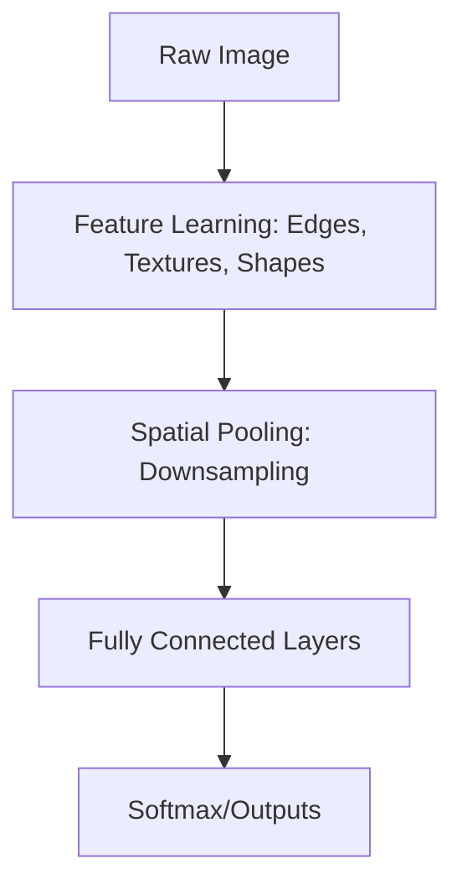

### Image Representation

#### Pixels
A pixel (picture element) is the smallest addressable physical point in a raster image. It is represented computationally as an integer or floating-point value indicating intensity.

#### RGB (Red, Green, Blue)
An RGB image is a 3D tensor of shape \([H, W, C]\) (or \([C, H, W]\) in frameworks like PyTorch) where:
*   \(H\): Height (spatial dimension)
*   \(W\): Width (spatial dimension)
*   \(C\): Channels (intensity of Red, Green, and Blue, typically scaled from 0 to 255 or 0.0 to 1.0).

#### Grayscale
A grayscale image is a 2D tensor \([H, W]\) (or 3D with \(C=1\)) representing luminance values (typically 0 for pure black, 255 for pure white).

#### Channels
Channels refer to the depth component of an image tensor. In hidden CNN layers, channels represent the number of extracted feature maps.

#### Resolution
Resolution defines the density of pixels, represented as \(H \times W\). Higher resolution preserves high-frequency spatial details but increases computational cost cubically in self-attention layers and quadratically in convolutional layers.

---

### Feature Learning Hierarchies

CNNs learn hierarchical representations. Lower layers extract low-level primitive features, while deeper layers combine them into high-level semantic abstractions.

```
[Input Image] 
      │
      ▼
[Layer 1: Low-Level Features] (Horizontal/Vertical/Diagonal Edges, Color gradients)
      │
      ▼
[Layer 2: Mid-Level Features] (Corners, Textures, Simple motifs, Junctions)
      │
      ▼
[Layer 3: High-Level Features] (Object parts: Eyes, Wheels, Text patterns)
      │
      ▼
[Layer 4: Semantic Concepts] (Full objects: Faces, Cars, Dogs, Cats)
```

1.  **Edges:** First-order gradients in pixel intensity (detected via small Kernels like Sobel or Gabor).
2.  **Corners & Textures:** Junctions of edges and repeating spatial patterns.
3.  **Shapes:** Aggregation of contours defining geometry.
4.  **Objects:** Full semantic entities assembled from component shapes.

---

### Core Concepts Explained

#### Receptive Field (RF)
*   **Definition:** The spatial region in the input image that influences a specific neuron's activation in layer \(L\).
*   **Purpose:** Enables the network to capture spatial context.
*   **Advantages:** Larger RF allows understanding of global structure and relationships between distant components.
*   **Disadvantages:** Increasing RF too quickly can blur fine-grained spatial details.
*   **Calculation Formula:**
    \[
    RF_0 = 1, \quad RF_l = RF_{l-1} + (k_l - 1) \cdot s_{cum}
    \]
    where \(k_l\) is kernel size, and \(s_{cum} = \prod_{i=1}^{l-1} s_i\) is the cumulative stride of all preceding layers.
*   **Real-world Analogy:** Peering through a telescope. The closer you look, the smaller your field of view; stepping back increases your field of view, letting you see the whole scene.

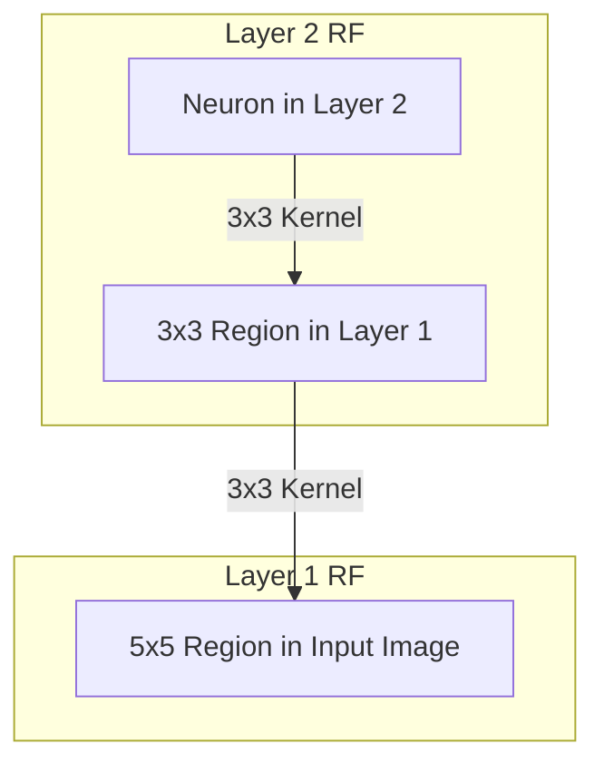

*   **Common Mistakes:** Forgetting that pooling layers and dilated convolutions expand the receptive field much faster than standard convolutions.

---

#### Weight Sharing
*   **Definition:** Applying the same kernel weights across all spatial positions of a feature map.
*   **Purpose:** Ensures translational equivariance and reduces parameters.
*   **Advantages:** Drastically lowers memory footprint; prevents overfitting.
*   **Disadvantages:** Assumes spatial stationarity. In specialized tasks (e.g., aligned face verification), translation invariance might be disadvantageous (hence why Locally Connected Layers are sometimes used).
*   **Real-world Analogy:** Using the same stamp to print a pattern across different areas of a canvas.

---

#### Sparse Connectivity (Local Connectivity)
*   **Definition:** Each neuron in a convolutional layer is connected only to a local region of the input tensor, rather than every input element.
*   **Purpose:** Exploit spatial locality in images.
*   **Advantages:** Drastically reduces computational complexity from \(\mathcal{O}(H \cdot W \cdot C_{in} \cdot H' \cdot W' \cdot C_{out})\) to \(\mathcal{O}(H \cdot W \cdot K^2 \cdot C_{in} \cdot C_{out})\).
*   **Disadvantages:** Restricts long-range dependency modeling in early layers.
*   **Real-world Analogy:** Reading a book word-by-word (local focus) instead of trying to process the entire page simultaneously.

---

#### Translation Invariance vs. Translation Equivariance
*   **Translation Equivariance:** If the input shifts, the output feature map shifts by the same amount:
    \[
    f(g(x)) = g(f(x))
    \]
    *Convolutions are inherently translation equivariant.*
*   **Translation Invariance:** The output representation remains unchanged even if the input shifts:
    \[
    f(g(x)) = f(x)
    \]
    *Pooling layers introduce translation invariance.*

---

#### Feature Maps & Activation Maps
*   **Feature Map:** The raw output of a convolutional operation (linear combinations of inputs and weights).
*   **Activation Map:** The feature map after passing through a non-linear activation function (e.g., ReLU).

---

#### Kernels & Filters
*   **Kernel:** A 2D matrix of weights (e.g., \(3 \times 3\)) that slides across a single channel.
*   **Filter:** A collection of kernels. A filter has depth equal to the number of input channels (e.g., \(3 \times 3 \times C_{in}\)). Applying \(C_{out}\) filters yields a tensor of depth \(C_{out}\).

```
       ┌───────────┐  ──┐
      ╱           ╱│    │
     ┌───────────┐ │    │ Kernel Size (K)
     │   Red     │ │    │
     │  Kernel   │╱│  ──┘
     └───────────┘ │
      ╱           ╱│
     ┌───────────┐ │
     │   Green   │ │    Input Channels (Cin)
     │  Kernel   │╱│
     └───────────┘ │
      ╱           ╱│
     ┌───────────┐ │
     │   Blue    │╱   
     │  Kernel   │    
     └───────────┘    
     │◄─────────►│
      Kernel Size (K)
```

---

#### Stride, Padding, and Dilation

```
Stride = 1: [x][x][x] -> [ ][x][x][x]
Stride = 2: [x][x][x] -> [ ][ ][x][x][x]

Padding (Valid): Shrinks spatial dimensions.
Padding (Same): Adds zeros around boundaries to maintain spatial shape.

Dilation = 1: [x][x][x] (Dense kernel)
Dilation = 2: [x][ ][x][ ][x] (Sparse kernel, larger receptive field)
```

*   **Stride (\(S\)):** The step size (in pixels) with which the filter slides across the input tensor.
*   **Padding (\(P\)):** Adding border values (typically zeros) around the input tensor before convolution.
    *   *Valid:* No padding (\(P=0\)). Spatial dimensions shrink.
    *   *Same:* Padding calculated to ensure spatial dimensions of output match input:
        \[
        P = \frac{K - 1}{2} \quad (\text{for } S=1)
        \]
*   **Dilation (\(D\)):** Inserting spaces (holes) between kernel elements. A dilation rate of \(D\) inserts \(D-1\) spaces.
    *   *Purpose:* Increases receptive field size exponentially without increasing parameters.
*   **Output Dimension Formula:**
    \[
    H_{out} = \left\lfloor \frac{H_{in} - K - (K-1)(D-1) + 2P}{S} \right\rfloor + 1
    \]

---

#### Pooling (Max, Average, Global Average)
*   **Max Pooling:** Selects the maximum value in a window. Captures dominant, high-frequency features (edges, activations).
*   **Average Pooling:** Computes the mean of values in a window. Captures smooth, low-frequency background details.
*   **Global Average Pooling (GAP):** Takes the average of each feature map across its entire spatial dimensions, yielding a \(1 \times 1 \times C\) vector.
    *   *Purpose:* Replaces memory-heavy Fully Connected layers at the end of networks, reducing overfitting.

---

#### Upsampling
*   **Nearest Neighbor:** Replicates pixel values. Low computation, blocky artifacts.
*   **Bilinear/Bicubic Interpolation:** Linear or cubic interpolation between coordinates. Smooth, but non-learnable.
*   **Transposed Convolution (Deconvolution):** Learnable upsampling using backward-pass convolution kernels. Can suffer from "checkerboard artifacts."
*   **Sub-Pixel Convolution (Pixel Shuffle):** Rearranges depth channels into spatial dimensions. Highly efficient and avoids checkerboard artifacts.

---

#### Flatten vs. Fully Connected (FC) Layer
*   **Flatten:** Reshapes a multi-dimensional tensor (e.g., \([B, C, H, W]\)) into a 2D tensor (\([B, C \cdot H \cdot W]\)).
*   **FC Layer:** Performs standard matrix multiplication: \(Y = XW + B\). Connects all spatial features to the output classes.

---

#### Softmax
*   **Definition:** Normalization function mapping logit outputs to a probability distribution.
    \[
    \text{Softmax}(z_i) = \frac{e^{z_i}}{\sum_{j=1}^{C} e^{z_j}}
    \]

---

#### Batch Normalization (BatchNorm)
*   **Definition:** Normalizes the activations of a mini-batch across spatial dimensions to have zero mean and unit variance.
    \[
    \hat{x} = \frac{x - \mu_B}{\sqrt{\sigma_B^2 + \epsilon}}, \quad y = \gamma \hat{x} + \beta
    \]
*   **Purpose:** Stabilizes training, reduces internal covariate shift, and allows higher learning rates.

---

#### Dropout
*   **Definition:** Randomly zeroing out a fraction \(p\) of activations during training.
*   **Purpose:** Regularizes the model, forcing it to learn redundant representations and preventing co-adaptation of features.

---

#### Residual Connections (Skip Connections)
*   **Definition:** Adding the input of a layer block back to its output:
    \[
    H(x) = F(x) + x
    \]
*   **Purpose:** Bypasses vanishing gradient problems in deep architectures by providing a direct highway for backpropagation gradients.

---

## Chapter 2 — CNN Pipeline

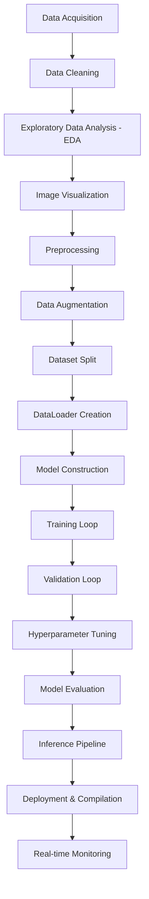

### Pipeline Stage Details

#### 1. Data Acquisition
*   **Purpose:** Gather representative visual data.
*   **Inputs:** Raw sensors, camera feeds, public repositories, web scraping.
*   **Outputs:** Standardized raw image database.
*   **Libraries:** `open-cv`, `PIL`, `urllib`, `selenium`, `boto3`.
*   **Best Practices:** Ensure diverse environmental conditions (lighting, angles, occlusion).
*   **Common Mistakes:** Underestimating class imbalance or labeling noise.

#### 2. Data Cleaning
*   **Purpose:** Remove corrupted, unreadable, duplicated, or mislabeled images.
*   **Inputs:** Raw database.
*   **Outputs:** Cleaned image directory.
*   **Libraries:** `hashlib` (duplicate detection), `Pillow` (corrupt verification).
*   **Best Practices:** Run automated scripts to verify PNG/JPEG headers before training.

#### 3. Exploratory Data Analysis (EDA)
*   **Purpose:** Analyze resolution distribution, class imbalance, and aspect ratios.
*   **Inputs:** Cleaned image directory.
*   **Outputs:** Summary statistics, imbalance ratios.
*   **Libraries:** `pandas`, `matplotlib`, `seaborn`.
*   **Best Practices:** Generate histograms of width-to-height ratios to determine optimal resizing strategy.

#### 4. Image Visualization
*   **Purpose:** Visually audit dataset, check annotations, and inspect anomalies.
*   **Inputs:** Images and labels.
*   **Outputs:** Plot grids.
*   **Libraries:** `matplotlib`, `FiftyOne`.
*   **Best Practices:** Overlay bounding boxes or masks directly onto source images.

#### 5. Preprocessing
*   **Purpose:** Standardize images for model consumption.
*   **Inputs:** Arbitrary resolution images.
*   **Outputs:** Resized, normalized tensor.
*   **Libraries:** `torchvision.transforms`, `albumentations`, `OpenCV`.
*   **Best Practices:** Normalize using ImageNet mean/std if using pretrained backbones:
    *   Mean: `[0.485, 0.456, 0.406]`
    *   Std: `[0.229, 0.224, 0.225]`
*   **Common Mistakes:** Applying data augmentation to validation/test datasets.

#### 6. Data Augmentation
*   **Purpose:** Synthetically expand dataset diversity to prevent overfitting.
*   **Inputs:** Standardized tensors.
*   **Outputs:** Transformed tensors.
*   **Libraries:** `Albumentations`, `Imgaug`, `Kornia`.
*   **Best Practices:** Match augmentation types to target scenarios (e.g., do not use vertical flips for text OCR).

#### 7. Dataset Split
*   **Purpose:** Allocate data to train, validate, and test models.
*   **Inputs:** Cleaned dataset.
*   **Outputs:** Partitioned splits (typically 70/15/15 or 80/10/10).
*   **Best Practices:** Use **Stratified Split** to preserve class distributions across splits.

#### 8. DataLoader Creation
*   **Purpose:** Efficiently batch and feed images into GPU/TPU.
*   **Inputs:** Split datasets.
*   **Outputs:** PyTorch/TensorFlow iterator batches.
*   **Best Practices:** Set `num_workers > 0` and `pin_memory=True` (for PyTorch on CUDA).

#### 9. CNN Architecture Design
*   **Purpose:** Choose or design a neural network suited for the task.
*   **Inputs:** Preprocessed tensor inputs.
*   **Outputs:** Network instance.
*   **Libraries:** `timm`, `torchvision.models`, `keras.applications`.
*   **Best Practices:** Prefer established backbones (e.g., ResNet, EfficientNet) via transfer learning over designing from scratch.

#### 10. Training Loop
*   **Purpose:** Optimize model parameters via backpropagation.
*   **Inputs:** Dataloader, optimizer, loss function, model.
*   **Outputs:** Trained weights.
*   **Libraries:** `torch.cuda.amp` (mixed precision), `accelerate`.
*   **Best Practices:** Implement gradient clipping to prevent exploding gradients.

#### 11. Validation Loop
*   **Purpose:** Monitor generalization error and select best checkpoints.
*   **Inputs:** Validation loader, model.
*   **Outputs:** Validation loss & metrics.
*   **Best Practices:** Set `model.eval()` and wrap in `with torch.no_grad():` to disable dropout and BN updates.

#### 12. Hyperparameter Tuning
*   **Purpose:** Optimize learning rate, weight decay, batch size, and architecture hyperparameters.
*   **Inputs:** Hyperparameter search space.
*   **Outputs:** Optimal hyperparameter configuration.
*   **Libraries:** `Optuna`, `Ray Tune`.
*   **Best Practices:** Use Bayesian search instead of grid search.

#### 13. Model Evaluation
*   **Purpose:** Perform final bias-variance check using held-out test data.
*   **Inputs:** Test loader, finalized checkpoint.
*   **Outputs:** Final confusion matrix, ROC curves, and metrics.

#### 14. Inference Pipeline
*   **Purpose:** Standardize real-time or batch prediction logic.
*   **Inputs:** Raw image file.
*   **Outputs:** Prediction dictionary (class, confidence score, bounding boxes).

#### 15. Deployment & Compilation
*   **Purpose:** Optimize model representation for target execution environments.
*   **Inputs:** Trained weights.
*   **Outputs:** Compiled binary (ONNX, TensorRT, OpenVINO, TFLite).
*   **Best Practices:** Quantize to INT8 or FP16 for edge deployments.

#### 16. Real-time Monitoring
*   **Purpose:** Detect data drift, performance degradation, and system latency spikes.
*   **Inputs:** Production inference inputs/outputs.
*   **Outputs:** Alert dashboards.
*   **Libraries:** `Prometheus`, `Grafana`, `Evidently AI`.

---

## Chapter 3 — CNN Internal Workflow

To understand how tensors flow, we trace a single image through a basic CNN.

### Step-by-Step Flow

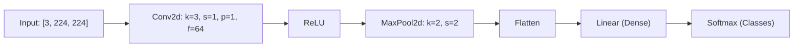

### Tensor Dimensions Table (Batch Size = \(B\))

| Layer Type | Configuration | Input Shape | Output Shape | Calculation Details |
| :--- | :--- | :--- | :--- | :--- |
| **Input** | RGB Image | - | `[B, 3, 224, 224]` | Raw input tensor |
| **Conv2d** | \(K=3, S=1, P=1\), 64 filters | `[B, 3, 224, 224]` | `[B, 64, 224, 224]` | \(\lfloor\frac{224-3+2(1)}{1}\rfloor+1 = 224\) |
| **ReLU** | Element-wise activation | `[B, 64, 224, 224]` | `[B, 64, 224, 224]` | Dimension unchanged |
| **MaxPool2d**| \(K=2, S=2, P=0\) | `[B, 64, 224, 224]` | `[B, 64, 112, 112]` | \(\lfloor\frac{224-2+0}{2}\rfloor+1 = 112\) |
| **Flatten** | Redundant spatial removal | `[B, 64, 112, 112]` | `[B, 64 * 112 * 112]` | Reshapes tensor to `[B, 802816]` |
| **Linear (FC)**| Output dimension = 10 classes | `[B, 802816]` | `[B, 10]` | Matrix multiplication: \([B, 802816] \times [802816, 10]\) |
| **Softmax** | Probabilistic normalization | `[B, 10]` | `[B, 10]` | Channel summation equals 1.0 |

---

## Chapter 4 — CNN Architectures

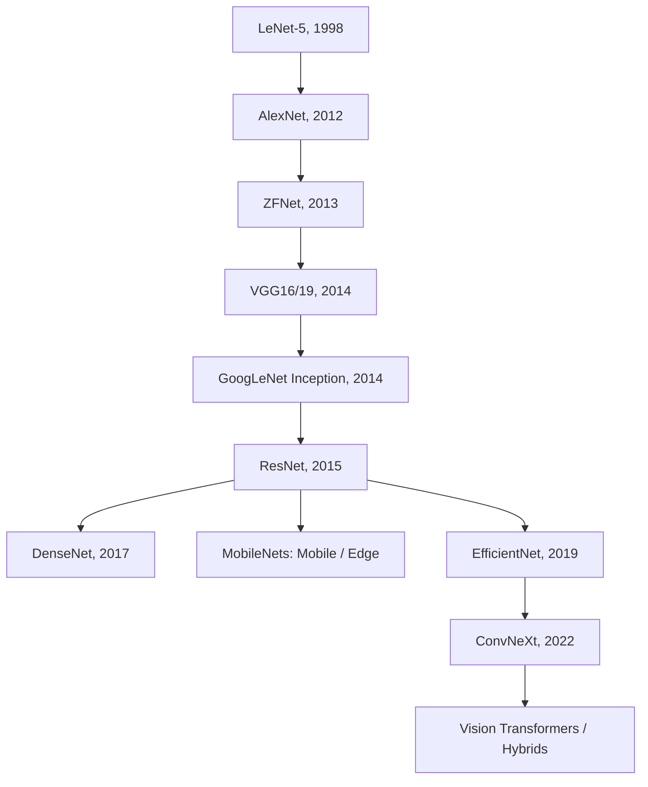

### Comprehensive Architectures Breakdown

#### LeNet-5 (1998)
*   **Motivation:** Digit recognition on checks (MNIST).
*   **Architecture:** Conv \(\rightarrow\) AvgPool \(\rightarrow\) Conv \(\rightarrow\) AvgPool \(\rightarrow\) FC \(\rightarrow\) FC.
*   **Strengths:** Simple, low compute footprint.
*   **Weaknesses:** Inadequate for complex natural images.

#### AlexNet (2012)
*   **Motivation:** Scaling up networks for ImageNet.
*   **Architecture:** First massive use of ReLU, Dropout, and GPUs. Large \(11\times11\) kernels.
*   **Strengths:** Sparked the deep learning revolution.
*   **Weaknesses:** High parameter count in final fully connected layers (60M).

#### ZFNet (2013)
*   **Motivation:** Visualizing features to optimize AlexNet.
*   **Architecture:** Replaced AlexNet's \(11\times11\) kernel with \(7\times7\) kernels and smaller stride. Used Deconvolutional layers to visualize activations.

#### VGG16 / VGG19 (2014)
*   **Motivation:** Showing that depth and small kernels (\(3\times3\)) are crucial.
*   **Architecture:** Stacked homogeneous \(3\times3\) convolutions with regular max pooling.
*   **Strengths:** Highly simple, clean design; excellent feature extractor.
*   **Weaknesses:** Extremely slow; computationally heavy (138M+ parameters).

#### GoogLeNet / Inception (v1, v2, v3) (2014)
*   **Motivation:** Improving parameter efficiency.
*   **Architecture:** Introduced the "Inception Module" executing multiple kernel sizes (\(1\times1, 3\times3, 5\times5\)) in parallel. Introduced bottleneck \(1\times1\) convolutions.
*   **Strengths:** High accuracy with low parameter counts (~7M).
*   **Weaknesses:** Fragmented architecture; high memory bandwidth usage.

#### ResNet (18, 34, 50, 101, 152) (2015)
*   **Motivation:** Overcoming vanishing gradients in very deep networks (>100 layers).
*   **Architecture:** Introduced Skip Connections bypass blocks (Residual block).
*   **Strengths:** Industry standard; easy to optimize; scales effectively to extreme depths.
*   **Weaknesses:** Cannot model long-range global relationships well without self-attention.

#### DenseNet (2017)
*   **Motivation:** Maximizing feature reuse.
*   **Architecture:** Every layer is connected to all subsequent layers:
    \[
    X_l = H_l([X_0, X_1, \dots, X_{l-1}])
    \]
*   **Strengths:** Parameter efficient; alleviates vanishing gradients.
*   **Weaknesses:** Extremely high GPU memory allocation during training due to concatenated tensors.

#### MobileNet (V1, V2, V3)
*   **Motivation:** Deploying on resource-constrained mobile devices.
*   **Architecture:**
    *   **V1:** Depthwise Separable Convolutions.
    *   **V2:** Inverted Residuals & Linear Bottlenecks.
    *   **V3:** Squeeze-and-Excitation attention with hardware-aware NAS.
*   **Strengths:** Highly efficient; low latency.

#### ShuffleNet
*   **Motivation:** Overcoming Pointwise Convolution latency bottlenecks on edge GPUs.
*   **Architecture:** Channel Shuffle operations coupled with Grouped Convolutions.

#### SqueezeNet
*   **Motivation:** Ultra-small model size (<5MB) for deployment with AlexNet-level accuracy.
*   **Architecture:** Fire Modules containing Squeeze and Expand phases.

#### EfficientNet (B0-B7) (2019)
*   **Motivation:** Finding the optimal scaling rule.
*   **Architecture:** Introduced **Compound Scaling**, scaling depth, width, and input resolution concurrently using a fixed coefficient:
    \[
    \text{depth: } \alpha^\phi, \quad \text{width: } \beta^\phi, \quad \text{resolution: } \gamma^\phi
    \]
*   **Strengths:** State-of-the-art accuracy with high efficiency.

#### EfficientNetV2
*   **Motivation:** Accelerating training speeds.
*   **Architecture:** Replaces Depthwise Convolutions in early stages with **Fused-MBConv** (convolves standard \(3\times3\) to leverage hardware acceleration).

#### ConvNeXt (2022)
*   **Motivation:** Modernizing classic CNN design to compete with Vision Transformers (ViTs).
*   **Architecture:** Large \(7\times7\) kernels, LayerNorm instead of BatchNorm, gelu activations, and inverted bottlenecks.

#### Vision Transformer (ViT) & Hybrid (CNN + ViT)
*   **Comparison:** ViTs split images into patches and process them using Self-Attention.
*   **Strengths:** Scales better with huge datasets; models global context from layer 0.
*   **Weaknesses:** Lacks inductive bias (requires massive pretraining datasets); computationally quadratic relative to patch resolution.

---

## Chapter 5 — CNN Building Blocks

### Critical Structural Components

#### 1. Standard Convolution Block
The foundation of traditional CNNs.
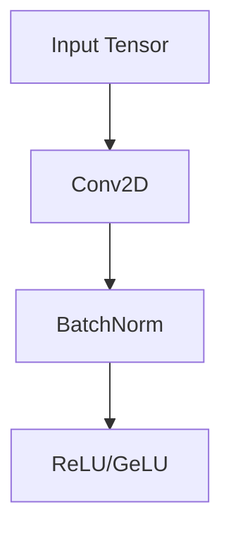

#### 2. Depthwise Separable Convolution
Breaks standard convolution into:
*   **Depthwise Convolution:** Performs a spatial convolving operation channel-by-channel.
*   **Pointwise Convolution:** Combines channel outputs using \(1\times1\) convolutions.
*   *Compute reduction factor:*
    \[
    \frac{1}{C_{out}} + \frac{1}{K^2} \quad (\text{typically 8-9x savings})
    \]

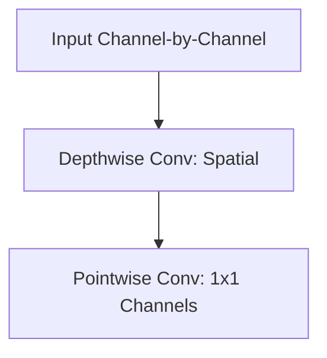

#### 3. Residual Block
Adds identity skipping.
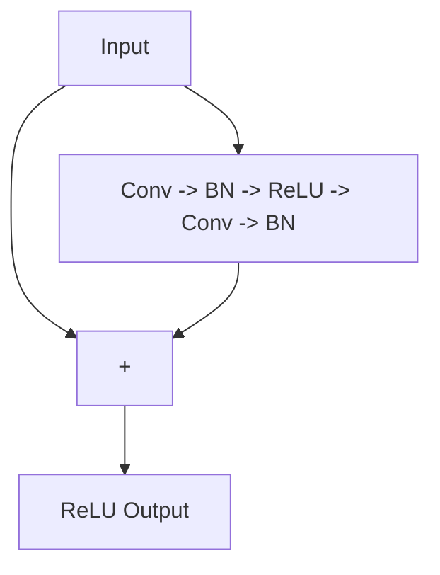

#### 5. Squeeze-and-Excitation (SE) Block
Performs channel-wise attention.
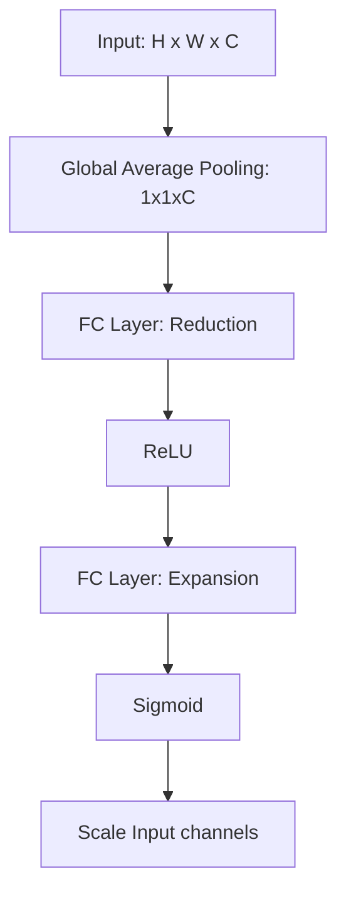

---

## Chapter 6 — CNN Use Cases

Here we outline standard end-to-end setups for major computer vision workflows.

### 1. Image Classification (Binary & Multi-class)
*   **Input:** Image tensor \([B, C, H, W]\).
*   **Model:** ResNet50 / EfficientNetV2.
*   **Loss:** Binary Cross-Entropy (BCE) or Categorical Cross-Entropy (CCE).
*   **Metrics:** Accuracy, F1-Score, Top-5 Accuracy.
*   **Deployment:** TensorRT on Edge Servers.

### 2. Medical Image Classification
*   **Use Cases:** Retinal Disease, Brain Tumor, Pneumonia Detection.
*   **Input:** Multi-modal (MRI, CT scans, X-rays).
*   **Challenges:** Severe data scarcity, high cost of labeling errors, class imbalance.
*   **Loss:** Focal Loss (to handle extreme class imbalance).
*   **Deployment:** ONNX runtime integrated into clinical PACS systems.

### 3. Image Segmentation
*   **Semantic Segmentation (U-Net, DeepLabv3+):** Every pixel is labeled with an object category.
*   **Instance Segmentation (Mask R-CNN):** Detects individual objects and outlines their boundaries.
*   **Loss:** Combo Loss (Dice Loss + Cross Entropy).
*   **Metrics:** Mean Intersection-over-Union (mIoU), Dice Coefficient.

```
Semantic: [Dog][Dog][Background] (Same color)
Instance: [Dog 1 (Red)][Dog 2 (Blue)][Background]
```

### 4. Object Detection (YOLOv8/v10, Faster R-CNN)
*   **Output:** Class prediction + bounding box coordinates \([x_{center}, y_{center}, w, h]\).
*   **Loss:** CIoU Loss (Complete IoU) + Focal Loss for classification.

### 5. Specialized Applications
*   **Face Recognition:** ArcFace / CosFace loss optimization for vector embeddings.
*   **Pose Estimation (HRNet):** Heatmap prediction of skeletal joints.
*   **OCR:** CNN + BiLSTM + Connectionist Temporal Classification (CTC) Loss.
*   **Anomaly Detection:** Reconstruction loss utilizing Convolutional Autoencoders or feature deviation.

---

## Chapter 7 — Transfer Learning

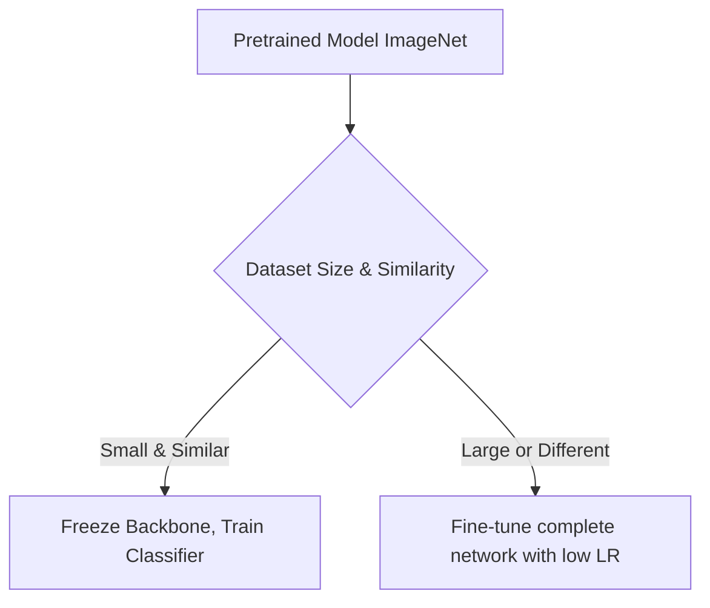

### Strategies Reference Table

| Target Dataset Size | Target Dataset Similarity | Strategy | Risk | Learning Rate |
| :--- | :--- | :--- | :--- | :--- |
| **Small** | **High Similarity** | Freeze backbone; train classification head. | Overfitting | Fast (1e-3 to 1e-2) |
| **Small** | **Low Similarity** | Freeze early layers; train deep layers + head. | Severe Overfitting | Medium (1e-4) |
| **Large** | **High Similarity** | Train complete network with pretrained init. | Co-adaptation break | Slow (1e-5 to 1e-4) |
| **Large** | **Low Similarity** | Train from scratch or fine-tune completely. | Long training time | High (1e-3) |

---

## Chapter 8 — Explainable AI (XAI)

XAI is essential for verifying that CNN models base predictions on meaningful features rather than dataset bias (e.g., classifying a wolf based on background snow).

### XAI Algorithms Matrix

| Algorithm | Mechanism | Advantages | Limitations |
| :--- | :--- | :--- | :--- |
| **Grad-CAM** | Uses gradients of target class flowing into the final convolutional layer to weight feature maps. | Simple; no structural model changes needed. | Coarse resolution map; misses fine-grained features. |
| **Grad-CAM++** | Incorporates pixel-wise second-order gradients. | Better localization of multiple instances of same class. | Computationally slower. |
| **Score-CAM** | Weighting based on forward-pass activation score maps. | Bypasses gradient noise. | High latency due to multiple forward passes. |
| **Integrated Gradients**| Integrates path gradients between a baseline image and input image. | Mathematically axiomatic; pixel-level resolution. | High compute requirements. |
| **SHAP / LIME** | Perturbation-based surrogate modeling. | Agnostic to model type. | High latency. |

---

## Chapter 9 — Training Pipeline

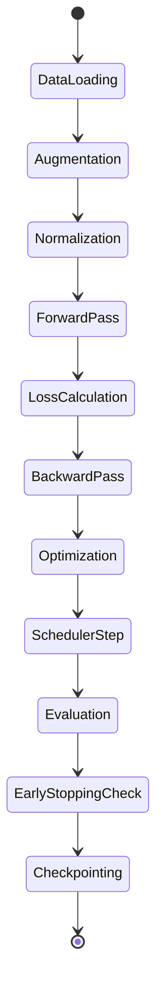

### PyTorch Core Implementation Template

```python
import torch
import torch.nn as nn
import torch.optim as optim
from torch.utils.data import DataLoader
from torch.cuda.amp import GradScaler, autocast

def train_epoch(model, dataloader, criterion, optimizer, scaler, device):
    model.train()
    running_loss = 0.0
    
    for inputs, targets in dataloader:
        inputs, targets = inputs.to(device), targets.to(device)
        optimizer.zero_grad(set_to_none=True)
        
        # Mixed Precision Forward Pass
        with autocast():
            outputs = model(inputs)
            loss = criterion(outputs, targets)
            
        # Scaled Backpropagation
        scaler.scale(loss).backward()
        
        # Gradient Clipping (Value/Norm)
        scaler.unscale_(optimizer)
        nn.utils.clip_grad_norm_(model.parameters(), max_norm=1.0)
        
        scaler.step(optimizer)
        scaler.update()
        
        running_loss += loss.item() * inputs.size(0)
        
    return running_loss / len(dataloader.dataset)
```

---

## Chapter 10 — Loss Functions

*   **Binary Cross Entropy (BCE):** Used for binary outcomes.
    \[
    L = -[y \log(p) + (1-y) \log(1-p)]
    \]
*   **Categorical Cross Entropy (CCE):** Used for multi-class outcomes.
    \[
    L = -\sum_c y_c \log(p_c)
    \]
*   **Dice Loss:** Maximizes spatial overlap for segmentation.
    \[
    L_{Dice} = 1 - \frac{2 |Y \cap P|}{|Y| + |P|}
    \]
*   **Focal Loss:** Handles class imbalance by down-weighting easy examples.
    \[
    L_{Focal} = -(1-p)^\gamma \log(p)
    \]
*   **Triplet Loss:** Metric learning to minimize distance between anchor-positive and maximize anchor-negative.
    \[
    L = \max(d(A, P) - d(A, N) + \alpha, 0)
    \]

---

## Chapter 11 — Evaluation Metrics

*   **Accuracy:** \(\frac{TP + TN}{TP + TN + FP + FN}\). Not suited for imbalanced datasets.
*   **Precision:** \(\frac{TP}{TP + FP}\). Minimizes false positives.
*   **Recall / Sensitivity:** \(\frac{TP}{TP + FN}\). Minimizes false negatives (critical in Medical Diagnostics).
*   **Specificity:** \(\frac{TN}{TN + FP}\). Ability to identify true negatives.
*   **F1-Score:** \(2 \times \frac{\text{Precision} \times \text{Recall}}{\text{Precision} + \text{Recall}}\). Harmonic mean balance.
*   **IoU (Intersection over Union):** \(\frac{|Y \cap P|}{|Y \cup P|}\). Standard for spatial object evaluation.

---

## Chapter 12 — CNN Best Practices

### The Production Checklist
*   **Input Scaling:** Resize inputs preserving aspect ratio using padding rather than stretching.
*   **Augmentation Strategy:** Always combine geometric transformations (rotation, crop) with color space perturbations (contrast, brightness).
*   **Optimizer Selection:** Start with **AdamW** (learning rate \(1\text{e-}3\), weight decay \(1\text{e-}2\)) for quick convergence; switch to **SGD with Momentum** for final deployment fine-tuning.
*   **Learning Rate Schedulers:** Use **Cosine Annealing with Warm Restarts** rather than static step decay.
*   **Reproducibility:** Seed all generators:
    ```python
    torch.manual_seed(42)
    torch.backends.cudnn.deterministic = True
    torch.backends.cudnn.benchmark = False
    ```

---

## Chapter 13 — CNN Common Mistakes

1.  **Mismatch of Normalization:** Using ImageNet normalization on target models without matching standard input dimensions.
2.  **Forgetting to Set Eval Mode:** Forgetting to call `model.eval()` before validation, leaving Dropout active and BatchNorm updating running stats.
3.  **Data Leakage via Augmentation:** Applying augmentation to validation or testing datasets.
4.  **Improper Loss Selection:** Combining `nn.CrossEntropyLoss()` (which integrates LogSoftmax internally) with a model outputting Softmax probabilities. This causes double normalization and halts gradient flow.
5.  **Unbalanced Classes with Standard Accuracy:** Evaluating imbalanced setups with accuracy. Use F1-Score, Balanced Accuracy, or Area Under Precision-Recall Curve (AUPRC).

---

## Chapter 14 — CNN Learning Roadmap

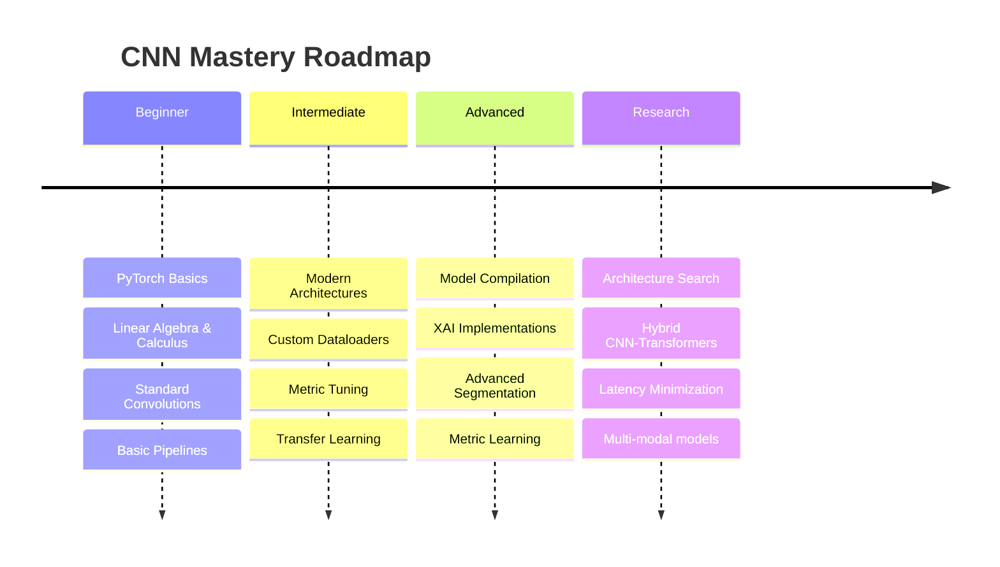

---

## Chapter 15 — Architecture Selection Guide

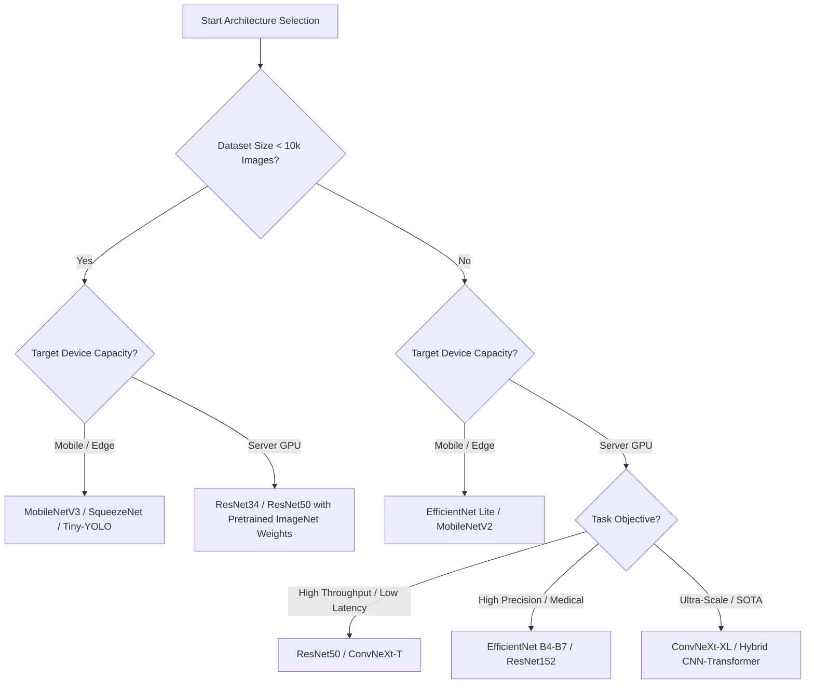

---

## Chapter 16 — Comprehensive Comparison Table

| Architecture | Parameters (M) | ImageNet Top-1 (%) | Relative GPU Memory | Edge Suitability | Preferred Use Cases |
| :--- | :--- | :--- | :--- | :--- | :--- |
| **LeNet-5** | < 0.1 | N/A | Microscopic | High (Microcontrollers) | Embedded numbers/digits |
| **VGG-16** | 138 | 71.5 | Massive | Poor | Feature Extraction, Style Transfer |
| **ResNet-50** | 25.6 | 76.1 | Moderate | Medium | Production General Classification |
| **MobileNetV3**| 5.4 | 75.2 | Low | Excellent | Real-time edge mobile detection |
| **EfficientNet-B4**| 19.3 | 82.9 | Moderate | Medium | High-accuracy medical analysis |
| **ConvNeXt-T** | 28.6 | 82.1 | Moderate | Medium | Modern SOTA vision pipelines |
| **ViT-B/16** | 86.0 | 79.8 | High | Poor | High-scale cloud setups |

---

## Chapter 17 — Real-world Pipelines

### 1. Autonomous Driving Pipeline
*   **Sensor Inputs:** Multi-camera 8MP video frames.
*   **Architecture:** Multi-scale backbone (RegNet/ResNet) feeding into FPN (Feature Pyramid Network) sharing weights between Semantic Segmentation (road layout) and Object Detection (pedestrians, cars).
*   **Compilation:** TensorRT FP16 compiled for NVIDIA Orin.

### 2. Medical AI Diagnostics
*   **Inputs:** High-resolution 3D CT scan slices.
*   **Pipeline:** 3D UNet segmentation of target organs followed by 3D ResNet classification.
*   **Validation:** Multi-center cross-validation ensuring zero data contamination.

---

## Chapter 18 — Final Cheat Sheets

### Hyperparameter Reference Card
*   **Optimizer:** `AdamW` (Defaults: `lr=1e-3`, `weight_decay=1e-2`, `eps=1e-8`).
*   **Learning Rate Warmup:** Warmup for 5-10 epochs from `1e-6` to max learning rate before starting decay.
*   **Batch Size:** Use largest batch size fitting in GPU memory. Adjust learning rate using the linear scaling rule if scaling batch size:
    \[
    LR_{new} = LR_{old} \times \frac{Batch_{new}}{Batch_{old}}
    \]

---

## Chapter 19 — References & Further Reading

1.  **LeNet-5 Paper:** LeCun, Y., et al. (1998). *Gradient-based learning applied to document recognition*. Proceedings of the IEEE.
2.  **AlexNet Paper:** Krizhevsky, A., et al. (2012). *ImageNet classification with deep convolutional neural networks*. NeurIPS.
3.  **ResNet Paper:** He, K., et al. (2016). *Deep residual learning for image recognition*. CVPR.
4.  **EfficientNet Paper:** Tan, M., & Le, Q. V. (2019). *EfficientNet: Rethinking model scaling for convolutional neural networks*. ICML.
5.  **PyTorch Documentation:** https://pytorch.org/docs
