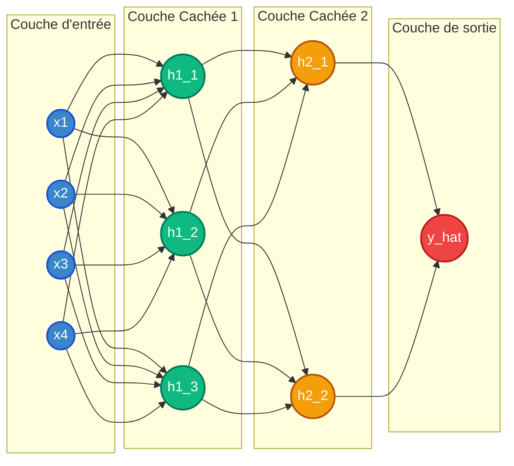

# Deep Learning : Cours Complet – Guide Ingénieur IA

*Débutant $\rightarrow$ Intermédiaire | Orientation Production*

---

## Table des Matières

1. [Fondamentaux du Deep Learning](#1-fondamentaux-du-deep-learning)
   - [1.1 Perceptron et Réseaux de Neurones](#11-perceptron-et-réseaux-de-neurones)
   - [1.2 Forward Propagation](#12-forward-propagation)
   - [1.3 Backpropagation & Chain Rule](#13-backpropagation--chain-rule)
2. [Fonctions d'Activation](#2-fonctions-dactivation)
   - [2.1 Sigmoid](#21-sigmoid)
   - [2.2 Tanh](#22-tanh)
   - [2.3 ReLU — Rectified Linear Unit](#23-relu--rectified-linear-unit)
   - [2.4 Leaky ReLU](#24-leaky-relu)
   - [2.5 ELU — Exponential Linear Unit](#25-elu--exponential-linear-unit)
   - [2.6 SELU — Scaled ELU](#26-selu--scaled-elu)
   - [2.7 Guide de Sélection Rapide](#27-guide-de-sélection-rapide)
3. [Initialisation des Poids](#3-initialisation-des-poids)
   - [3.1 Xavier / Glorot Initialization](#31-xavier--glorot-initialization)
   - [3.2 He Initialization](#32-he-initialization)
   - [3.3 LeCun Initialization](#33-lecun-initialization)
   - [3.4 Code PyTorch — Initialisation Manuelle](#34-code-pytorch--initialisation-manuelle)
4. [Optimisation](#4-optimisation)
   - [4.1 Gradient Descent & Mini-batch](#41-gradient-descent--mini-batch)
   - [4.2 Momentum](#42-momentum)
   - [4.3 Adam — Adaptive Moment Estimation](#43-adam--adaptive-moment-estimation)
   - [4.4 Code PyTorch — Choix de l'Optimiseur](#44-code-pytorch--choix-de-loptimiseur)
5. [Problèmes Majeurs en Deep Learning](#5-problèmes-majeurs-en-deep-learning)
   - [Problème 1 — Vanishing Gradients (Gradients Évanescents)](#problème-1--vanishing-gradients-gradients-évanescents)
   - [Problème 2 — Exploding Gradients (Gradients Explosifs)](#problème-2--exploding-gradients-gradients-explosifs)
   - [Problème 3 — Overfitting (Sur-apprentissage)](#problème-3--overfitting-sur-apprentissage)
   - [Problème 4 — Underfitting (Sous-apprentissage)](#problème-4--underfitting-sous-apprentissage)
   - [Problème 5 — Dying ReLU](#problème-5--dying-relu)
   - [Problème 6 — Instabilité de l'Entraînement](#problème-6--instabilité-de-lentraînement)
   - [Code — Détection et Correction des Gradients Exploding](#code--détection-et-correction-des-gradients-exploding)
6. [Techniques de Stabilisation](#6-techniques-de-stabilisation)
   - [6.1 Batch Normalization](#61-batch-normalization)
   - [6.2 Dropout](#62-dropout)
   - [6.3 Weight Decay (Régularisation L2)](#63-weight-decay-régularisation-l2)
   - [6.4 Early Stopping](#64-early-stopping)
7. [Bonnes Pratiques en Production](#7-bonnes-pratiques-en-production)
   - [7.1 Normalisation des Données](#71-normalisation-des-données)
   - [7.2 Shuffle des Datasets](#72-shuffle-des-datasets)
   - [7.3 Choix du Batch Size](#73-choix-du-batch-size)
   - [7.4 Learning Rate Tuning](#74-learning-rate-tuning)
8. [Cas Réels — CNN, NLP & Séries Temporelles](#8-cas-réels--cnn-nlp--séries-temporelles)
   - [8.1 Vision par Ordinateur — CNN](#81-vision-par-ordinateur--cnn)
   - [8.2 NLP — Traitement du Langage Naturel](#82-nlp--traitement-du-langage-naturel)
   - [8.3 Séries Temporelles — Finance](#83-séries-temporelles--finance)
9. [Récapitulatif — Checklist Ingénieur IA](#récapitulatif--checklist-ingénieur-ia)

---

## 1. Fondamentaux du Deep Learning

### 1.1 Perceptron et Réseaux de Neurones

Le **perceptron** est l'unité de base de tout réseau de neurones. Il s'inspire du neurone biologique : il reçoit des signaux en entrée, les pondère, les somme, puis décide de s'activer ou non. Un perceptron seul peut seulement apprendre des fonctions **linéairement séparables**. En empilant des couches de perceptrons, on crée un **Multi-Layer Perceptron (MLP)** capable d'apprendre des représentations non-linéaires complexes.

Mathématiquement, un neurone calcule :
$$z = w_1 x_1 + w_2 x_2 + \dots + w_n x_n + b = W^T x + b$$
$$a = f(z)$$

Où $x$ sont les entrées, $W$ les poids (*weights*), $b$ le biais (*bias*), $f$ la fonction d'activation et $a$ la sortie du neurone.

#### Architecture d'un réseau de neurones

| Composant | Rôle |
| :--- | :--- |
| **Couche d'entrée (Input Layer)** | Reçoit les données brutes (pixels, features…). Pas d'activation. |
| **Couches cachées (Hidden Layers)** | Apprennent des représentations abstraites. C'est ici que la "magie" opère. |
| **Couche de sortie (Output Layer)** | Produit la prédiction finale (classe, valeur, probabilité…). |
| **Poids $W$ et biais $b$** | Paramètres appris pendant l'entraînement par descente de gradient. |
| **Fonction d'activation $f$** | Introduit la non-linéarité — indispensable pour apprendre des patterns complexes. |

---

### 1.2 Forward Propagation

La **propagation avant (forward pass)** est le processus par lequel les données traversent le réseau de la couche d'entrée vers la couche de sortie pour produire une prédiction. C'est un simple enchaînement de multiplications matricielles + activation.

Pour un réseau à $L$ couches :
$$a^{[0]} = x \text{ (entrée)}$$
$$z^{[l]} = W^{[l]} \cdot a^{[l-1]} + b^{[l]}$$
$$a^{[l]} = f^{[l]}(z^{[l]})$$
$$\hat{y} = a^{[L]} \text{ (prédiction finale)}$$

#### Visualisation : Forward Propagation & Backpropagation

La figure ci-dessous représente la circulation de l'information au sein d'un réseau de neurones multicouche. Elle met en évidence les deux phases clés de l'entraînement : la propagation avant (calcul de la sortie) et la rétropropagation (mise à jour des poids).



> **Description de la figure 1.1 :**
> - **Sens de propagation avant ($\rightarrow$) :** Des données d'entrée ($Input\ Layer$) vers la couche de sortie ($Output\ Layer$), l'information subit des combinaisons linéaires et des activations à travers les couches cachées ($Hidden\ Layer\ 1$ et $2$).
> - **Sens de rétropropagation ($\leftarrow$) :** Permet de remonter le gradient de l'erreur ($\frac{\partial L}{\partial W}$) depuis la sortie vers l'entrée pour ajuster les poids.

#### Exemple de code — Forward Pass en NumPy

```python
import numpy as np

def sigmoid(z):
    return 1 / (1 + np.exp(-z))

def relu(z):
    return np.maximum(0, z)

def forward_pass(X, weights, biases, activations):
    """
    X : (n_features, m_samples)
    weights : liste de matrices W par couche
    biases : liste de vecteurs b par couche
    activations: liste des fonctions d'activation par couche
    """
    a = X # entrée = activation de la couche 0
    cache = [a] # on stocke les activations pour la backprop
    for W, b, act_fn in zip(weights, biases, activations):
        z = W @ a + b # combinaison linéaire
        a = act_fn(z) # activation non-linéaire
        cache.append(a)
    return a, cache # a = prédiction
```

---

### 1.3 Backpropagation & Chain Rule

La **rétropropagation (backpropagation)** est l'algorithme qui permet d'**ajuster les poids** du réseau pour minimiser l'erreur de prédiction. Elle repose sur la **règle de la chaîne** (*chain rule*) du calcul différentiel pour propager le gradient de la loss de la sortie vers l'entrée.

*Intuition : "À quel point chaque poids est-il responsable de l'erreur ?"*

> [!NOTE]
> **Schéma mental :**
> Imaginez que vous êtes le chef d'une cuisine. Si le plat final est raté, vous remontez la chaîne : le saucier a trop salé $\rightarrow$ il a ajouté trop de sel. La backprop fait exactement ça : elle remonte la chaîne de responsabilité vers chaque paramètre.

#### Formule clé — Règle de la chaîne :
$$\frac{\partial L}{\partial W^{[l]}} = \frac{\partial L}{\partial a^{[l]}} \cdot \frac{\partial a^{[l]}}{\partial z^{[l]}} \cdot \frac{\partial z^{[l]}}{\partial W^{[l]}}$$

#### Mise à jour des poids (descente de gradient) :
$$W^{[l]} \leftarrow W^{[l]} - \eta \cdot \frac{\partial L}{\partial W^{[l]}}$$

Où $\eta$ (*eta*) est le **learning rate**, et $\frac{\partial L}{\partial W}$ est le gradient de la loss par rapport aux poids — il indique la direction à suivre pour diminuer l'erreur.

#### Fonctions de perte courantes :

| Loss Function | Formule & Usage |
| :--- | :--- |
| **MSE (régression)** | $L = \frac{1}{m} \sum (\hat{y} - y)^2$ <br> $\rightarrow$ Problèmes de régression |
| **Binary Cross-Entropy** | $L = - [y \cdot \log(\hat{y}) + (1-y) \cdot \log(1 - \hat{y})]$ <br> $\rightarrow$ Classification binaire |
| **Categorical Cross-Entropy** | $L = - \sum y_c \cdot \log(\hat{y}_c)$ <br> $\rightarrow$ Classification multi-classe |
| **MAE (régression robuste)** | $L = \frac{1}{m} \sum |\hat{y} - y|$ <br> $\rightarrow$ Robuste aux outliers |

---

## 2. Fonctions d'Activation

Les fonctions d'activation introduisent la **non-linéarité** dans le réseau. Sans elles, empiler des couches n'aurait aucun sens : le réseau entier se réduirait à une simple transformation linéaire, incapable d'apprendre des patterns complexes.

#### Courbes des principales fonctions d'activation (Figure 2.1)
* **Sigmoid** $\sigma(x)$ s'écrase entre $0$ et $1$. Elle sature et provoque du vanishing gradient pour les valeurs extrêmes.
* **Tanh** est centrée en $0$ et varie de $-1$ à $1$, offrant une meilleure convergence.
* **ReLU** est nulle pour $x < 0$ et linéaire pour $x \ge 0$, simple et rapide.
* **Leaky ReLU** évite le problème des neurones morts en conservant une petite pente négative ($\alpha = 0.01$).
* **ELU** lisse la transition pour les valeurs négatives avec une décroissance exponentielle.
* **SELU** est une version auto-normalisante de ELU sous contraintes d'initialisation spécifiques.

---

### 2.1 Sigmoid

$$\sigma(x) = \frac{1}{1 + e^{-x}} \quad \Big| \quad \text{Sortie } \in (0, 1)$$

| Aspect | Détail |
| :--- | :--- |
| **Avantages** | Sortie interprétable comme probabilité. Différentiable partout. |
| **Inconvénients** | Vanishing gradient pour $|x| > 3$. Sortie non centrée (toujours positive). Coûteux ($\exp$). |
| **Erreur fréquente** | L'utiliser dans les couches cachées $\rightarrow$ gradients qui disparaissent après quelques couches. |
| **Quand l'utiliser** | **UNIQUEMENT** en sortie pour classification binaire. |

---

### 2.2 Tanh

$$\tanh(x) = \frac{e^x - e^{-x}}{e^x + e^{-x}} = 2\sigma(2x) - 1 \quad \Big| \quad \text{Sortie } \in (-1, 1)$$

| Aspect | Détail |
| :--- | :--- |
| **Avantages** | Centrée en 0 $\rightarrow$ meilleure convergence que Sigmoid. Gradient plus fort autour de 0. |
| **Inconvénients** | Toujours victime du vanishing gradient pour $|x|$ grands. |
| **Quand l'utiliser** | LSTM/GRU (RNN), parfois dans de petits réseaux. Supérieure à Sigmoid dans les couches cachées. |

---

### 2.3 ReLU — Rectified Linear Unit

$$\text{ReLU}(x) = \max(0, x) \quad \Big| \quad \text{Sortie } \in [0, +\infty)$$

| Aspect | Détail |
| :--- | :--- |
| **Avantages** | Très simple et rapide. Pas de vanishing gradient pour $x > 0$. Standard en CNN/MLP. |
| **Inconvénients** | **Dying ReLU** : si $x < 0$, gradient = 0, neurone mort permanent. |
| **Erreur fréquente** | Mauvaise initialisation ou LR trop grand $\rightarrow$ trop de neurones morts ($> 50\%$). |
| **Quand l'utiliser** | Couches cachées de CNN et MLP (défaut recommandé). |

---

### 2.4 Leaky ReLU

$$\text{LeakyReLU}(x) = \begin{cases} x & \text{si } x > 0 \\ \alpha x & \text{si } x \le 0 \end{cases} \quad (\alpha = 0.01 \text{ typiquement})$$

| Aspect | Détail |
| :--- | :--- |
| **Avantages** | Résout le *Dying ReLU* en gardant un petit gradient négatif. |
| **Inconvénients** | $\alpha$ est un hyperparamètre supplémentaire à tuner. |
| **Quand l'utiliser** | Remplacement de ReLU quand on observe du *Dying ReLU*. |

---

### 2.5 ELU — Exponential Linear Unit

$$\text{ELU}(x) = \begin{cases} x & \text{si } x > 0 \\ \alpha(e^x - 1) & \text{si } x \le 0 \end{cases}$$

| Aspect | Détail |
| :--- | :--- |
| **Avantages** | Activations négatives $\rightarrow$ sortie moyenne proche de 0 (auto-normalisant). Gradient continu en 0. |
| **Inconvénients** | Calcul de $\exp()$ coûteux. Légèrement plus lent que ReLU. |
| **Quand l'utiliser** | Réseaux profonds où l'auto-normalisation aide la convergence. |

---

### 2.6 SELU — Scaled ELU

$$\text{SELU}(x) = \lambda \cdot \text{ELU}(x) \quad \text{où } \lambda \approx 1.0507, \ \alpha \approx 1.6733$$

> [!NOTE]
> SELU est auto-normalisant : sous certaines conditions (initialisation LeCun + entrées normalisées), les activations convergent automatiquement vers $\mu=0, \sigma=1$. **Pas besoin de BatchNorm !**

| Aspect | Détail |
| :--- | :--- |
| **Avantages** | Auto-normalisation. Très bon pour les MLP profonds sans BatchNorm. |
| **Inconvénients** | Requiert initialisation LeCun. Ne fonctionne pas bien avec CNNs ou dropout classique. |
| **Quand l'utiliser** | MLP profonds (*tabular data*, séries temporelles). |

---

### 2.7 Guide de Sélection Rapide

| Couche / Contexte | Activation recommandée |
| :--- | :--- |
| **Couches cachées (CNN, MLP général)** | ReLU $\rightarrow$ première option. Leaky ReLU si *Dying ReLU*. |
| **MLP profond sans BatchNorm** | ELU ou SELU. |
| **Sortie classification binaire** | Sigmoid. |
| **Sortie classification multi-classe** | Softmax. |
| **Sortie régression** | Linéaire (pas d'activation). |
| **RNN / LSTM** | Tanh (états cachés), Sigmoid (gates). |
| **Transformers** | GELU (variante douce de ReLU). |

---

## 3. Initialisation des Poids

L'initialisation des poids est **critique** pour l'entraînement. De mauvaises valeurs initiales provoquent soit la **disparition** soit l'**explosion** des gradients dès les premières itérations, rendant l'apprentissage impossible.
L'idée clé : garder la variance des activations stable à travers les couches.

#### Principe fondamental :
$$\text{Var}(a^{[l]}) \approx \text{Var}(a^{[l-1]}) \quad \text{pour tout } l$$

Si la variance augmente couche après couche $\rightarrow$ **explosion**. Si elle diminue $\rightarrow$ **vanishing**. L'initialisation vise à maintenir cette variance constante.

---

### 3.1 Xavier / Glorot Initialization

Conçue pour les activations **linéaires, Sigmoid ou Tanh**.

$$W \sim \text{Uniform}\left(-\sqrt{\frac{6}{n_{in}+n_{out}}}, \ +\sqrt{\frac{6}{n_{in}+n_{out}}}\right)$$

Ou de façon équivalente (distribution normale) :
$$W \sim N(0, \sigma^2) \quad \text{avec } \sigma^2 = \frac{2}{n_{in} + n_{out}}$$

Où $n_{in}$ = nombre de neurones entrants et $n_{out}$ = nombre de neurones sortants. Cette formule s'assure que la variance reste stable pour Tanh/Sigmoid.

---

### 3.2 He Initialization

Conçue pour **ReLU et ses variantes**. Tient compte que ReLU annule la moitié des neurones.

$$W \sim N(0, \sigma^2) \quad \text{avec } \sigma^2 = \frac{2}{n_{in}}$$

Le facteur 2 compense le fait que ReLU met à zéro la moitié des activations, réduisant de moitié la variance effective. **Initialisation par défaut avec ReLU.**

---

### 3.3 LeCun Initialization

Conçue pour **SELU**. Variante de Xavier avec uniquement $n_{in}$.

$$W \sim N(0, \sigma^2) \quad \text{avec } \sigma^2 = \frac{1}{n_{in}}$$

#### Tableau récapitulatif des stratégies d'initialisation

| Initialisation | Formule $\sigma^2$ | Activation cible | Framework |
| :--- | :--- | :--- | :--- |
| **Xavier / Glorot** | $\sigma^2 = \frac{2}{n_{in}+n_{out}}$ | Sigmoid, Tanh, Linéaire | `keras: glorot_uniform` (défaut) |
| **He** | $\sigma^2 = \frac{2}{n_{in}}$ | ReLU, Leaky ReLU, ELU | `keras: he_normal` |
| **LeCun** | $\sigma^2 = \frac{1}{n_{in}}$ | SELU | `keras: lecun_normal` |
| **Zéros** | $W = 0$ | **JAMAIS** (symétrie $\rightarrow$ tous neurones identiques) | - |
| **Aléatoire uniforme** | $W \sim U(-0.1, 0.1)$ | Petit réseau uniquement | - |

---

### 3.4 Code PyTorch — Initialisation manuelle

```python
import torch
import torch.nn as nn

class MLP(nn.Module):
    def __init__(self, layers_dims):
        super().__init__()
        self.layers = nn.ModuleList()
        for i in range(len(layers_dims) - 1):
            layer = nn.Linear(layers_dims[i], layers_dims[i+1])
            
            # He init pour ReLU
            nn.init.kaiming_normal_(layer.weight, mode="fan_in", nonlinearity="relu")
            
            # Biais à 0 (standard)
            nn.init.zeros_(layer.bias)
            self.layers.append(layer)
            
        # Alternative Xavier pour Tanh :
        # nn.init.xavier_normal_(layer.weight)
```

---

## 4. Optimisation

L'optimisation est le cœur de l'entraînement : comment ajuster les poids $W$ et $b$ pour minimiser la loss $L$ ? La descente de gradient est la fondation, et ses variantes modernes (Adam) résolvent ses limitations majeures.

### 4.1 Gradient Descent & Mini-batch

La mise à jour de base :
$$W \leftarrow W - \eta \cdot \nabla L(W)$$

| Variante | Description & Trade-offs |
| :--- | :--- |
| **Batch GD (Full)** | Gradient calculé sur tout le dataset. Stable mais très lent pour grands datasets. |
| **Stochastic GD (SGD)** | Gradient sur 1 exemple. Rapide mais très bruité $\rightarrow$ convergence instable. |
| **Mini-batch GD** | Gradient sur un batch de $m$ exemples (32-512). Meilleur compromis vitesse/stabilité. |

> [!TIP]
> **Règle pratique :**
> Batch size de 32 à 256 pour la plupart des tâches. Pour les transformers : 512-4096. Des batchs trop petits = entraînement bruité. Trop grands = moins de généralisation + mémoire GPU.

---

### 4.2 Momentum

> [!NOTE]
> **Intuition :**
> Imaginez une bille qui roule dans un paysage. Sans momentum, elle s'arrête au moindre creux local. Avec momentum, elle accumule de la vitesse et dépasse les petits obstacles.

$$v \leftarrow \beta \cdot v + (1-\beta) \cdot \nabla L(W) \quad (\beta \approx 0.9)$$
$$W \leftarrow W - \eta \cdot v$$

Le vecteur de vitesse $v$ accumule les gradients passés. $\beta=0.9$ signifie que le gradient actuel compte 10% et l'historique 90%. Résultat : accélération dans les directions cohérentes, amortissement dans les directions bruitées.

---

### 4.3 Adam — Adaptive Moment Estimation

Adam est de loin l'optimiseur le plus utilisé en Deep Learning. Il combine Momentum (1er moment) et RMSProp (2ème moment) avec une correction de biais.

$$m \leftarrow \beta_1 \cdot m + (1-\beta_1) \cdot \nabla L \quad \text{(1er moment — momentum)}$$
$$v \leftarrow \beta_2 \cdot v + (1-\beta_2) \cdot (\nabla L)^2 \quad \text{(2ème moment — variance)}$$
$$\hat{m} = \frac{m}{1-\beta_1^t}, \quad \hat{v} = \frac{v}{1-\beta_2^t} \quad \text{(correction de biais)}$$
$$W \leftarrow W - \eta \cdot \frac{\hat{m}}{\sqrt{\hat{v}} + \epsilon}$$

**Valeurs par défaut :** $\beta_1=0.9$, $\beta_2=0.999$, $\epsilon=1e-8$, $\eta=0.001$. Elles fonctionnent bien dans 95% des cas — rarement besoin de les changer.

#### Pourquoi Adam est-il le standard ?

| Avantage | Explication |
| :--- | :--- |
| **Learning rate adaptatif** | Chaque paramètre a son propre LR ajusté automatiquement. |
| **Robuste à l'initialisation** | Fonctionne bien même avec un LR par défaut de 0.001. |
| **Gère les gradients rares** | Parfait pour NLP (tokens rares) et données sparses. |
| **Convergence rapide** | Généralement 2-5$\times$ plus rapide que SGD + Momentum classique. |

#### Visualisation : Convergence des Optimiseurs (Figure 4.1)
La figure 4.1 du document original montre les courbes de convergence de différents optimiseurs sur un historique de 100 Epochs :
* **SGD pur :** Présente la descente la plus lente et subit des oscillations bruitées majeures.
* **SGD + Momentum :** Améliore la rapidité de convergence par rapport au SGD pur mais reste sous-optimal.
* **RMSProp :** Assure une convergence rapide et stabilise les oscillations.
* **Adam :** Affiche la courbe la plus abrupte et stable, atteignant l'erreur minimale le plus rapidement.

---

### 4.4 Code PyTorch — Choix de l'optimiseur

```python
import torch.optim as optim

# Adam — par défaut pour la plupart des tâches
optimizer = optim.Adam(model.parameters(), lr=1e-3, betas=(0.9, 0.999), eps=1e-8)

# AdamW — Adam avec weight decay correct (recommandé pour Transformers)
optimizer = optim.AdamW(model.parameters(), lr=1e-3, weight_decay=1e-2)

# SGD + Momentum — parfois meilleure généralisation (CNN classiques)
optimizer = optim.SGD(model.parameters(), lr=0.01, momentum=0.9, nesterov=True)

# Boucle d'entraînement
for epoch in range(100):
    for X_batch, y_batch in dataloader:
        optimizer.zero_grad() # Toujours reset les gradients !
        y_pred = model(X_batch)
        loss = criterion(y_pred, y_batch)
        loss.backward() # Calcul des gradients
        optimizer.step() # Mise à jour des poids
```

---

## 5. Problèmes Majeurs en Deep Learning

#### Visualisation : Vanishing vs Exploding Gradients (Figure 5.1)
Le schéma montre l'évolution de la magnitude des gradients à travers les couches (en partant de la sortie vers l'entrée) :
* **Vanishing Gradients :** Décroissance exponentielle de la magnitude (ex. de $10^1$ vers $10^{-1}$), les premières couches ne recevant presque plus de gradient.
* **Exploding Gradients :** Croissance exponentielle de la magnitude (ex. de $10^1$ vers $10^3$), provoquant des oscillations explosives.

---

### Problème 1 — Vanishing Gradients (Gradients Évanescents)

* **Explication :** Pendant la backpropagation, les gradients deviennent exponentiellement petits en remontant vers les couches profondes. Les poids des premières couches n'apprennent pratiquement plus.
* **Cause :** Les fonctions Sigmoid et Tanh saturent aux extrêmes (gradient $\approx 0$ pour $|x| > 3$). Avec 10 couches Sigmoid : gradient $\approx (0.25)^{10} \approx 10^{-6} \rightarrow$ quasi-nul.
* **Symptômes :** Loss diminue très lentement ou se bloque. Les premières couches ont des gradients $\sim 0$ (à inspecter via Tensorboard). Poids (*weights*) quasi-statiques dans les premières couches.
* **Solutions :**
  1. Utiliser ReLU / Leaky ReLU au lieu de Sigmoid/Tanh.
  2. Batch Normalization entre les couches.
  3. Connexions résiduelles (ResNet — *skip connections*).
  4. Initialisation He/Xavier adaptée.
  5. Gradient clipping si nécessaire.

---

### Problème 2 — Exploding Gradients (Gradients Explosifs)

* **Explication :** À l'inverse du vanishing, les gradients croissent exponentiellement lors de la backprop. Les poids font des sauts gigantesques et l'entraînement diverge.
* **Cause :** Mauvaise initialisation (grands poids initiaux). Learning rate trop élevé. Réseaux très profonds ou récurrents (BPTT). Données non normalisées.
* **Symptômes :** Loss explose vers `NaN` ou `inf`. Les poids deviennent `NaN`. Courbe de loss instable avec des pics énormes.
* **Solutions :**
  1. Gradient Clipping : `torch.nn.utils.clip_grad_norm_(params, max_norm=1.0)`.
  2. Initialisation correcte (He/Xavier).
  3. Réduire le learning rate.
  4. BatchNorm.
  5. Normaliser les données d'entrée.

---

### Problème 3 — Overfitting (Sur-apprentissage)

#### Visualisation : Underfitting / Bon Fit / Overfitting (Figure 5.2)
* **Underfitting (modèle trop simple) :** Tentative d'ajuster des données non linéaires avec une simple droite. L'erreur est importante.
* **Bon Fit (modèle adapté) :** Courbe fluide qui capture l'allure générale des données sans s'attacher au bruit.
* **Overfitting (modèle trop complexe) :** Courbe sinueuse et chaotique qui passe par chacun des points du dataset, incluant les perturbations aléatoires.

* **Explication :** Le modèle mémorise les données d'entraînement au lieu d'apprendre les patterns généraux. Il performe très bien sur train mais échoue sur des données nouvelles.
* **Cause :** Modèle trop complexe (trop de paramètres) par rapport à la quantité de données. Entraînement trop long sans régularisation.
* **Symptômes :** Écart croissant entre train loss et validation loss. Accuracy train $\gg$ accuracy validation. Courbes qui divergent.
* **Solutions :**
  1. Dropout ($p=0.3\text{-}0.5$ dans les couches denses).
  2. Weight Decay / L2 Regularization.
  3. Early Stopping.
  4. Data Augmentation (vision).
  5. Réduire la capacité du modèle.
  6. Collecter plus de données (meilleure solution).

---

### Problème 4 — Underfitting (Sous-apprentissage)

* **Explication :** Le modèle est trop simple pour capturer la complexité des données. Il performe mal même sur les données d'entraînement.
* **Cause :** Architecture trop petite. Features insuffisantes. Learning rate trop grand (convergence vers un mauvais minimum). Entraînement trop court.
* **Symptômes :** Train loss élevée qui stagne. Accuracy faible en train ET validation. Le modèle fait des erreurs "stupides" sur des exemples simples.
* **Solutions :**
  1. Augmenter la capacité du modèle (plus de couches/neurones).
  2. Entraîner plus longtemps.
  3. Réduire le learning rate.
  4. Feature engineering : ajouter/améliorer les features.
  5. Réduire la régularisation si trop forte.

---

### Problème 5 — Dying ReLU

* **Explication :** Des neurones ReLU tombent dans un état "mort" : ils sortent toujours 0, leur gradient est toujours 0, et ils n'apprennent plus jamais.
* **Cause :** Si $z < 0 \rightarrow \text{ReLU}(z) = 0$ ET gradient = 0. Un neurone qui reçoit toujours des entrées négatives ne recevra jamais de gradient et restera mort définitivement.
* **Symptômes :** Beaucoup de neurones inactifs (à inspecter via les distributions d'activations). Performance médiocre malgré un réseau large. Amélioration stagnante.
* **Solutions :**
  1. Leaky ReLU ou ELU à la place de ReLU.
  2. Réduire le learning rate (évite les grandes mises à jour négatives).
  3. Initialisation He avec biais initiaux légèrement positifs (0.01).
  4. BatchNorm avant ReLU.

---

### Problème 6 — Instabilité de l'Entraînement

* **Explication :** La loss oscille fortement, ne converge pas, ou diverge sans raison apparente. L'entraînement est imprévisible et difficile à reproduire.
* **Cause :** Learning rate mal calibré. Données non normalisées. Batchs trop petits. Gradients non clippés dans les RNNs. Mélange de précisions (FP16/FP32) mal géré.
* **Symptômes :** Loss qui monte et descend chaotiquement. `NaN` après quelques epochs. Résultats non reproductibles même avec même seed.
* **Solutions :**
  1. Normaliser les données ($\mu=0, \sigma=1$).
  2. Batch Normalization.
  3. Gradient Clipping (`max_norm=1.0`).
  4. Learning rate scheduler (warm-up + decay).
  5. Fixer les seeds (`torch.manual_seed`, `np.random.seed`).
  6. Vérifier les `NaN` dans les données d'entrée.

#### Code — Détection et correction des gradients exploding

```python
# Gradient Clipping — à ajouter AVANT optimizer.step()
loss.backward()

# Afficher la norme des gradients (debug)
total_norm = 0
for p in model.parameters():
    if p.grad is not None:
        total_norm += p.grad.data.norm(2).item() ** 2
total_norm = total_norm ** 0.5
print(f"Gradient norm: {total_norm:.4f}") # Si > 10 → clipping nécessaire

# Clipping (max_norm = seuil de coupure)
torch.nn.utils.clip_grad_norm_(model.parameters(), max_norm=1.0)
optimizer.step()
```

---

## 6. Techniques de Stabilisation

### 6.1 Batch Normalization

BatchNorm normalise les activations de chaque couche pour qu'elles aient une distribution stable ($\mu \approx 0, \sigma \approx 1$). Cela réduit le problème de **covariate shift interne** : le fait que la distribution des entrées d'une couche change à chaque batch pendant l'entraînement.

#### Visualisation : Effet de Batch Normalization sur la distribution des activations (Figure 6.1)
* **Avant BatchNorm (distribution bruitée) :** L'histogramme affiche une distribution désaxée ($\mu = 7.98$) et très étalée.
* **Après BatchNorm ($\mu \approx 0, \sigma \approx 1$) :** L'histogramme se recentre sur une moyenne de $\mu = -0.00$ avec une variance unitaire resserrée.

#### Formule de BatchNorm (pendant l'entraînement) :
$$\mu_B = \frac{1}{m} \sum_{i=1}^m x_i \quad \text{(moyenne du batch)}$$
$$\sigma^2_B = \frac{1}{m} \sum_{i=1}^m (x_i - \mu_B)^2 \quad \text{(variance)}$$
$$\hat{x}_i = \frac{x_i - \mu_B}{\sqrt{\sigma^2_B + \epsilon}} \quad \text{(normalisation)}$$
$$y_i = \gamma \cdot \hat{x}_i + \beta \quad \text{(scale \& shift apprenables)}$$

$\gamma$ et $\beta$ sont des paramètres apprenables qui permettent au réseau de "dé-normaliser" si nécessaire — BatchNorm ne force pas une sortie centrée, elle laisse le réseau décider.

#### Avantages de Batch Normalization

| Avantage de BatchNorm | Explication |
| :--- | :--- |
| **Permet des LR plus élevés** | Distributions stables $\rightarrow$ gradients bien conditionnés $\rightarrow$ peut apprendre plus vite. |
| **Agit comme régulariseur** | Le bruit dû à la statistique du batch réduit légèrement l'overfitting. |
| **Réduit dépendance à l'init** | Le réseau est moins sensible à l'initialisation des poids. |
| **Accélère la convergence** | Typiquement 2-10$\times$ plus rapide à converger. |

#### Code PyTorch — BatchNorm

```python
import torch.nn as nn

class CNN_with_BN(nn.Module):
    def __init__(self):
        super().__init__()
        self.net = nn.Sequential(
            nn.Conv2d(3, 64, kernel_size=3, padding=1),
            nn.BatchNorm2d(64), # BatchNorm APRÈS la conv
            nn.ReLU(),          # Activation APRÈS BatchNorm
            nn.MaxPool2d(2),
            
            nn.Linear(1024, 256),
            nn.BatchNorm1d(256), # BatchNorm1d pour les couches Dense
            nn.ReLU(),
        )

# model.train() active BatchNorm en mode entraînement (stats du batch)
# model.eval() utilise les stats mobiles (running mean/var)
```

---

### 6.2 Dropout

> [!NOTE]
> **Intuition :**
> Pendant l'entraînement, Dropout éteint aléatoirement une fraction $p$ des neurones à chaque forward pass. Le réseau est forcé d'apprendre des représentations redondantes et robustes — aucun neurone ne peut devenir "trop indispensable". C'est comme entraîner un ensemble de modèles simultanément.

#### Formule :
$$a_{drop} = \frac{a \cdot \text{mask}}{1 - p} \quad \Big| \quad (\text{mask} \sim \text{Bernoulli}(1-p))$$

La division par $(1-p)$ est la normalisation **inverted dropout** : elle garde l'espérance des activations constante pendant l'entraînement, simplifiant l'inférence (pas de scaling au test).

```python
class MLP_Dropout(nn.Module):
    def __init__(self, input_dim, hidden_dim, output_dim, dropout_p=0.5):
        super().__init__()
        self.net = nn.Sequential(
            nn.Linear(input_dim, hidden_dim),
            nn.ReLU(),
            nn.Dropout(p=dropout_p), # Dropout APRÈS activation
            nn.Linear(hidden_dim, hidden_dim),
            nn.ReLU(),
            nn.Dropout(p=dropout_p),
            nn.Linear(hidden_dim, output_dim)
        )

# ERREUR FRÉQUENTE : oublier model.eval() en inférence !
# model.train() → Dropout actif (neurones éteints aléatoirement)
# model.eval() → Dropout désactivé (tous les neurones actifs)
model.eval()
with torch.no_grad():
    predictions = model(X_test)
```

> [!TIP]
> **Taux de Dropout recommandés :**
> - Couches Dense/MLP : $p = 0.3$ à $0.5$
> - Couches CNN : $p = 0.1$ à $0.3$ (moins agressif)
> - Transformers : $p = 0.1$ (attention dropout)
> - **Ne pas appliquer** de Dropout à la couche de sortie.

---

### 6.3 Weight Decay (Régularisation L2)

Le Weight Decay ajoute une pénalité à la loss proportionnelle à la norme L2 des poids. Cela décourage les poids trop grands et force le modèle vers des solutions plus "simples".

$$L_{total} = L_{data} + \lambda \cdot \sum ||W||^2$$

Ce qui revient à un "shrinkage" des poids à chaque step :
$$W \leftarrow W \cdot (1 - \eta \cdot \lambda) - \eta \cdot \nabla L_{data}$$

```python
# Avec Adam (attention : AdamW est préférable !)
optimizer = optim.Adam(model.parameters(), lr=1e-3, weight_decay=1e-4)

# AdamW — weight decay "correct" (découplé du gradient adaptatif)
optimizer = optim.AdamW(model.parameters(), lr=1e-3, weight_decay=1e-2)
# AdamW est le standard pour les Transformers (BERT, GPT…)
```

---

### 6.4 Early Stopping

Early Stopping arrête l'entraînement dès que la **validation loss** cesse de s'améliorer pendant $N$ epochs (patience). On restaure ensuite les meilleurs poids observés. Simple, efficace, et sans coût computationnel.

```python
class EarlyStopping:
    def __init__(self, patience=10, min_delta=1e-4, restore_best=True):
        self.patience = patience
        self.min_delta = min_delta
        self.restore_best = restore_best
        self.best_loss = float("inf")
        self.counter = 0
        self.best_weights = None

    def step(self, val_loss, model):
        if val_loss < self.best_loss - self.min_delta:
            self.best_loss = val_loss
            self.counter = 0
            if self.restore_best:
                import copy
                self.best_weights = copy.deepcopy(model.state_dict())
        else:
            self.counter += 1
            
        if self.counter >= self.patience:
            if self.restore_best and self.best_weights:
                model.load_state_dict(self.best_weights)
            return True # Stop!
        return False

# Exemple d'usage:
stopper = EarlyStopping(patience=15)
for epoch in range(1000):
    val_loss = validate(model)
    if stopper.step(val_loss, model):
        print(f"Early stop à l'epoch {epoch}")
        break
```

---

## 7. Bonnes Pratiques en Production

### 7.1 Normalisation des Données

La normalisation est une des étapes les plus impactantes. Des features à des échelles très différentes rendent la descente de gradient inefficace : le gradient pointe dans des directions déformées par les échelles, et le LR optimal varie par feature.

```python
from sklearn.preprocessing import StandardScaler, MinMaxScaler
import numpy as np

# StandardScaler — z-score (µ=0, σ=1)
# RECOMMANDÉ pour MLP, CNN, RNN
scaler = StandardScaler()
X_train_norm = scaler.fit_transform(X_train) # fit sur train seulement !
X_val_norm = scaler.transform(X_val)         # transform seulement (pas fit)
X_test_norm = scaler.transform(X_test)       # Idem

# MinMaxScaler — [0, 1]
# Pour les images (déjà en [0,255] → diviser par 255)
X_img = X_img.astype(np.float32) / 255.0
```

> [!WARNING]
> **ERREUR CLASSIQUE :** Normaliser sur tout le dataset (provocation de *data leakage* !).
> `scaler.fit(X_all)` $\leftarrow$ **NE PAS FAIRE**

```python
# Pour les images PyTorch (ImageNet standards)
from torchvision import transforms

transform = transforms.Compose([
    transforms.ToTensor(),
    transforms.Normalize(mean=[0.485, 0.456, 0.406],
                         std=[0.229, 0.224, 0.225]),
])
```

---

### 7.2 Shuffle des Datasets

Mélanger les données avant (et pendant) l'entraînement est essentiel. Sans shuffle, le modèle voit toujours les classes dans le même ordre, ce qui biaise les estimations de gradient des mini-batches.

```python
from torch.utils.data import DataLoader, TensorDataset

# shuffle=True obligatoire pour le training set
train_loader = DataLoader(
    dataset=train_dataset,
    batch_size=64,
    shuffle=True,       # ← Mélange à chaque epoch
    num_workers=4,      # Chargement parallèle
    pin_memory=True,    # Accélère le transfert CPU→GPU
)

# shuffle=False pour val et test (reproductibilité)
val_loader = DataLoader(val_dataset, batch_size=128, shuffle=False)
```

---

### 7.3 Choix du Batch Size

#### Visualisation : Impact du Learning Rate (Figure 7.1)
Le comportement de l'apprentissage dépend fortement de l'association du LR et du batch size :
* **LR trop faible (0.0001) :** Courbe de loss bruitée déclinant trop lentement (manque de dynamisme).
* **LR optimal (0.01) :** Courbe propre décroissante rapidement vers une perte proche de zéro.
* **LR trop élevé (0.5) :** Oscillations chaotiques de forte amplitude, l'entraînement ne converge pas.

| Batch Size | Comportement & Recommandation |
| :--- | :--- |
| **Très petit (1-8)** | Gradient bruité, entraînement lent. Bon pour la généralisation mais impraticable. |
| **Petit (16-64)** | Bon compromis. Légèrement bruité $\rightarrow$ effet régularisant. Standard pour MLP/CNN. |
| **Moyen (128-512)** | Stable, entraînement rapide. Préféré si la mémoire GPU le permet. |
| **Grand (1024+)** | Très stable mais peut mener à une moins bonne généralisation (*sharp minima*). Ajuster le LR proportionnellement. |

> [!NOTE]
> **Règle du Linear Scaling :**
> Si vous doublez le batch size, doublez aussi le learning rate.
> - Batch 32 $\rightarrow$ LR = 0.001
> - Batch 64 $\rightarrow$ LR = 0.002
> - Batch 128 $\rightarrow$ LR = 0.004
> *Valider toujours empiriquement.*

---

### 7.4 Learning Rate Tuning

Le learning rate est l'hyperparamètre le plus important. Voici les stratégies les plus efficaces.

1. **LR Finder (technique de Smith 2017) :**
   Augmenter le LR exponentiellement et trouver le "genou" de la courbe de loss.

```python
from torch.optim.lr_scheduler import OneCycleLR

# ① One Cycle Policy — warm-up + decay
scheduler = OneCycleLR(
    optimizer,
    max_lr=1e-2,
    steps_per_epoch=len(train_loader),
    epochs=50,
    pct_start=0.3, # 30% du temps en warm-up
)

# ② ReduceLROnPlateau — réduire LR si stagnation
scheduler = torch.optim.lr_scheduler.ReduceLROnPlateau(
    optimizer, mode="min", factor=0.5, patience=5, verbose=True
)
# Appeler après chaque epoch :
scheduler.step(val_loss)

# ③ Cosine Annealing — LR oscille en cosinus
scheduler = torch.optim.lr_scheduler.CosineAnnealingLR(
    optimizer, T_max=50, eta_min=1e-6
)
```

---

## 8. Cas Réels — CNN, NLP & Séries Temporelles

### 8.1 Vision par Ordinateur — CNN

Les **Convolutional Neural Networks (CNN)** sont l'architecture de référence pour les images. Contrairement aux MLP, les CNN exploitent la structure spatiale des images : les filtres convolutifs détectent des motifs locaux (bords, textures) qui se combinent en représentations de plus en plus abstraites.

| Opération CNN | Rôle |
| :--- | :--- |
| **Conv2d (3×3, 5×5)** | Extrait des features locales (bords, formes). Partage de poids $\rightarrow$ efficace. |
| **BatchNorm2d** | Stabilise l'entraînement entre les couches conv. |
| **ReLU** | Non-linéarité standard après chaque conv. |
| **MaxPool2d / AvgPool2d** | Réduit la résolution spatiale (*downsampling*). Robustesse aux translations. |
| **Dropout2d** | Régularisation pour les couches conv. |
| **Flatten + Linear** | Convertit les feature maps en vecteur pour la classification. |

```python
import torch.nn as nn

class ConvNet(nn.Module):
    """CNN pour classification d'images (ex: CIFAR-10, 32×32×3 → 10 classes)"""
    def __init__(self, num_classes=10):
        super().__init__()
        
        # Bloc convolutif 1
        self.block1 = nn.Sequential(
            nn.Conv2d(3, 32, kernel_size=3, padding=1), # 32×32×32
            nn.BatchNorm2d(32),
            nn.ReLU(),
            nn.Conv2d(32, 32, kernel_size=3, padding=1), # 32×32×32
            nn.BatchNorm2d(32),
            nn.ReLU(),
            nn.MaxPool2d(2, 2), # 16×16×32
            nn.Dropout2d(0.1),
        )
        
        # Bloc convolutif 2
        self.block2 = nn.Sequential(
            nn.Conv2d(32, 64, kernel_size=3, padding=1), # 16×16×64
            nn.BatchNorm2d(64),
            nn.ReLU(),
            nn.MaxPool2d(2, 2), # 8×8×64
        )
        
        # Classifieur
        self.classifier = nn.Sequential(
            nn.Flatten(), # 8×8×64 = 4096
            nn.Linear(4096, 256),
            nn.ReLU(),
            nn.Dropout(0.5), # Régularisation forte
            nn.Linear(256, num_classes) # Pas de softmax ici (CrossEntropyLoss l'inclut)
        )

    def forward(self, x):
        x = self.block1(x)
        x = self.block2(x)
        return self.classifier(x)
```

#### Transfer Learning — Stratégie recommandée en production

```python
import torchvision.models as models

model = models.resnet50(pretrained=True)

# Geler les couches early (features génériques)
for param in model.parameters():
    param.requires_grad = False
    
# Remplacer seulement la couche de sortie
model.fc = nn.Linear(model.fc.in_features, num_classes)

# Fine-tuner uniquement la dernière couche (ou débloquer les derniers blocs)
```

---

### 8.2 NLP — Traitement du Langage Naturel

En NLP, les données sont des séquences de tokens (mots, sous-mots). L'architecture **Transformer** (BERT, GPT) est devenue le standard, mais comprendre les RNNs/LSTMs reste essentiel pour les séquences courtes ou les ressources limitées.

#### Approche 1 : Fine-tuning BERT (Transformers — HuggingFace)

```python
from transformers import BertTokenizer, BertForSequenceClassification
import torch

tokenizer = BertTokenizer.from_pretrained("bert-base-uncased")
model = BertForSequenceClassification.from_pretrained(
    "bert-base-uncased",
    num_labels=2 # Classification binaire (positif/négatif)
)

# Tokenisation
texts = ["I love deep learning!", "This is terrible."]
inputs = tokenizer(texts, padding=True, truncation=True, max_length=128, return_tensors="pt")

# Forward pass
outputs = model(**inputs)
logits = outputs.logits # (batch, num_labels)
probs = torch.softmax(logits, dim=-1)
```

#### Approche 2 : LSTM from scratch (séquences courtes)

```python
class SentimentLSTM(nn.Module):
    def __init__(self, vocab_size, embed_dim=128, hidden_dim=256, n_layers=2):
        super().__init__()
        self.embedding = nn.Embedding(vocab_size, embed_dim)
        self.lstm = nn.LSTM(embed_dim, hidden_dim, n_layers,
                            batch_first=True, dropout=0.3, bidirectional=True)
        self.fc = nn.Linear(hidden_dim * 2, 1) # ×2 car bidirectionnel
        self.sigmoid = nn.Sigmoid()

    def forward(self, x):
        embedded = self.embedding(x) # (B, T, embed_dim)
        out, (h, c) = self.lstm(embedded) # h: (2*n_layers, B, hidden)
        
        # Prendre le dernier état caché (fw + bw)
        h = torch.cat((h[-2,:,:], h[-1,:,:]), dim=1) # (B, hidden*2)
        return self.sigmoid(self.fc(h))
```

---

### 8.3 Séries Temporelles — Finance

La prédiction de séries temporelles (prix d'actions, volatilité, volumes) est un cas d'usage classique des LSTM et, plus récemment, des Transformers temporels (Temporal Fusion Transformer, PatchTST).

```python
import numpy as np
import torch
import torch.nn as nn

# Préparation des données en fenêtres glissantes
def create_sequences(data, seq_len=60, forecast_horizon=5):
    """
    data : array (T, n_features) — OHLCV normalisé
    seq_len : lookback window (60 jours)
    forecast_horizon : nb de jours à prédire
    """
    X, y = [], []
    for i in range(len(data) - seq_len - forecast_horizon):
        X.append(data[i : i + seq_len])
        y.append(data[i + seq_len : i + seq_len + forecast_horizon, 0]) # Close price
    return np.array(X), np.array(y)

# Modèle LSTM pour la prédiction financière
class FinanceLSTM(nn.Module):
    def __init__(self, n_features=5, hidden=128, n_layers=3, forecast=5):
        super().__init__()
        self.lstm = nn.LSTM(n_features, hidden, n_layers, batch_first=True, dropout=0.2)
        self.attention = nn.Linear(hidden, 1) # Mécanisme d'attention simple
        self.fc = nn.Sequential(
            nn.Linear(hidden, 64),
            nn.ReLU(),
            nn.Dropout(0.3),
            nn.Linear(64, forecast)
        )

    def forward(self, x):
        lstm_out, _ = self.lstm(x) # (B, T, hidden)
        
        # Attention sur les timesteps
        attn = torch.softmax(self.attention(lstm_out), dim=1) # (B, T, 1)
        context = (lstm_out * attn).sum(dim=1) # (B, hidden)
        return self.fc(context)
```

#### Entraînement avec perte Huber (robuste aux outliers financiers)

```python
criterion = nn.HuberLoss(delta=1.0) # Plus robuste que MSE sur données financières
optimizer = torch.optim.AdamW(model.parameters(), lr=1e-3, weight_decay=1e-4)
scheduler = torch.optim.lr_scheduler.ReduceLROnPlateau(
    optimizer, mode="min", factor=0.5, patience=10
)
```

> [!WARNING]
> **ERREUR FRÉQUENTE en finance :**
> - Ne **JAMAIS** shuffler les données temporelles (*data leakage* temporel).
> - Toujours respecter l'ordre chronologique : `train = passé`, `val = milieu`, `test = futur`.
> - `train_loader = DataLoader(train_ds, shuffle=False)` $\leftarrow$ **obligatoire**.

---

## Récapitulatif — Checklist Ingénieur IA

| Étape | Actions & Vérifications |
| :--- | :--- |
| **Données** | Normaliser (StandardScaler). Vérifier NaN/inf. Shuffle (train). Pas de data leakage. |
| **Architecture** | Commencer simple. He init + ReLU + BatchNorm. Ajouter la complexité progressivement. |
| **Optimisation** | Adam (lr=1e-3) ou AdamW. LR scheduler. Gradient clipping si RNN. |
| **Entraînement** | Monitorer train + val loss. Early stopping. Checkpointer le meilleur modèle. |
| **Régularisation** | Dropout (0.3-0.5). Weight decay (1e-4). Data augmentation (vision). |
| **Debug** | Overfit 1 batch en priorité. Inspecter les gradients. Vérifier la structure des tenseurs (*shapes*). |
| **Production** | `model.eval()` + `torch.no_grad()`. Export ONNX ou TorchScript. Benchmark de la latence. |
